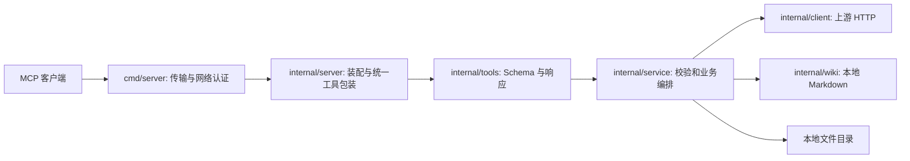

# xktmcp 项目分析报告

分析基线：2026-09-24，提交 `b37d09a`。本报告以当前源码、配置和测试为依据；运行验证结果见文末。旧版报告引用的 SDK 版本和部分未修复问题已不适用于当前代码。

## 1. 项目定位与现状

`xktmcp` 是 Go 编写的 MCP 服务端，把学生、教职工、RAG、Wiki 和服务器本地文件能力暴露给 MCP 客户端。模块为 `github.com/wuxujun/xktmcp`，`go.mod` 指定 Go 1.25.0 和 `go1.25.13` 工具链，MCP Go SDK 为 v1.7.0。

服务支持 stdio、SSE 和 Streamable HTTP 三种传输。当前注册表定义了 14 个工具名，分属学生 4 个、教职工 1 个、RAG 1 个、Wiki 5 个和文件 3 个；另有 3 个按工具可用性注册的 Prompt。Wiki 本地模式可选择注册 Catalog、Tree 和 Page Resources，订阅尚未实现。

## 2. 架构与数据流

| 模块 | 当前职责 |
| --- | --- |
| `cmd/server` | 传输选择、网络认证、会话凭据绑定、HTTP 日志、探针、指标端点和优雅退出。 |
| `internal/server` | 按 `MCP_ENABLED_TOOLS` 注册工具、Prompt 和可选 Wiki Resources；统一注入追踪、审计与工具指标。 |
| `internal/tools`、`internal/service`、`internal/model` | MCP 参数和结果、输入校验、服务调用及数据结构。 |
| `internal/client` | 学生、教职工、RAG、远程 Wiki 的上游 HTTP 调用、重试与独立熔断器。 |
| `internal/wiki` | 本地 Wiki 配置、搜索索引、目录树、页面读写及反向链接。 |
| `internal/auth`、`pii`、`trace`、`logger`、`metrics` | 认证授权、脱敏、请求关联、结构化日志及 Prometheus 指标。 |

默认 Wiki 后端为远程 HTTP。选择本地模式后，Wiki 由 `internal/wiki` 读取 Markdown；文件工具由 `FILE_SEARCH_ROOT` 控制，使用独立服务，不依赖 Wiki 的目录或配置。Wiki Resources 只在本地模式显式启用时注册。

## 3. 启动与配置边界

| 场景 | 最小关键配置 | 代码行为 |
| --- | --- | --- |
| 默认 stdio | `API_TOKEN` | 默认注册全部可用工具；`BASE_URL` 未设置时使用 `https://yk.xkt.com`。stdio 不要求 MCP 网络认证。 |
| HTTP 或 SSE | `API_TOKEN`，以及 `AUTH_TOKEN`、`AUTH_TENANTS`、有效远程验证或 IP 白名单中的至少一种 | 网络传输在未启用认证器时拒绝启动；HTTP 路径为 `/mcp`，SSE 使用 `/sse` 和 `/messages/`。 |
| 纯文件工具白名单 | `FILE_SEARCH_ROOT`、`MCP_ENABLED_TOOLS=file_*`（或任意文件工具组合） | 不要求 `API_TOKEN` 或 Wiki 配置。 |
| 仅本地 Wiki | `config/wiki.json` 选择 `local`，并用 `MCP_ENABLED_TOOLS` 只启用 Wiki 工具 | 可跳过上游 `API_TOKEN`；本地根目录和用户映射由 Wiki 配置决定。 |

`MCP_ENABLED_TOOLS` 未设置时尝试注册全部工具；文件根目录未配置时文件工具不注册，但默认的上游工具仍使 `API_TOKEN` 成为启动条件。白名单支持具体工具名和匹配已知工具的 `wiki_*`、`file_*` 一类前缀，未知名称会导致启动失败。纯文件工具白名单在文件目录验证后直接完成注册，不加载 Wiki 或上游配置。网络传输另需认证；`API_TOKEN` 是访问上游的凭据，不能替代 MCP 客户端的 Bearer 凭据。

## 4. 安全与可运维性

- `AUTH_TENANTS` 支持令牌哈希、工具权限、可选可信 `user_id` 和租户限流；远程验证 URL 必须通过主机白名单校验。可信身份与请求 `userId` 冲突时拒绝请求。有状态 SSE 和旧版 Streamable HTTP 会话绑定建连凭据。
- MCP POST 请求体限制为 4 MiB，读取期限为 30 秒。HTTP 日志的请求/响应内容默认关闭；按需开启时应注意业务数据可能进入日志。工具结果和审计字段具备手机号、证件号等脱敏处理，不能把它视为所有敏感内容的通用过滤器。
- `/health` 与 `/ready` 不认证，分别表示进程存活和初始化完成；`/ready` 不检查上游持续可用性。`/metrics` 可通过 `METRICS_AUTH_TOKEN` 单独加 Bearer 认证，未设置时无认证。部署时应按网络边界保护这些端点。
- 文件根目录对所有获准使用文件工具的调用者共享，不按 `userId` 隔离。Wiki 本地多用户映射只有在可信认证主体与请求身份绑定时才能构成安全隔离；共享 Token、IP 白名单和 stdio 中的 `userId` 只是路由信息。
- 上游调用有退避重试和按业务模块隔离的熔断器；工具调用、缓存和熔断状态提供 Prometheus 指标。GSE 文件搜索与本地 Wiki 的索引在进程内维护，重启后需要重建。

## 5. 测试覆盖与后续关注

仓库在 `cmd/server`、`internal/server`、`internal/auth`、`internal/client`、`internal/wiki`、`internal/service` 等包中有同目录测试，覆盖注册、认证、传输会话、资源权限、文件搜索和本地 Wiki 行为。`cmd/server` 的真实服务联调测试需显式设置 `MCP_RUN_LIVE_TESTS=true`。

旧版报告列为“未闭合”的请求体无限读取、无效远程验证仍启用、RAG 检索参数无效等结论已过时：当前认证读取有 4 MiB 上限，远程验证 URL 在初始化时校验主机，RAG 的 `top_k`、`min_score`、`include_sources` 和 `include_chunks` 已参与结果构建。

当前最值得保持关注的是部署配置与权限边界：默认启动需要上游令牌，网络入口需要独立 MCP 认证，本地文件目录是共享范围，探针与指标端点需要合适的网络控制。修改身份、资源或文件访问逻辑时，应优先运行对应包的安全和隔离测试。

## 6. 本次验证

`go test ./internal/server -count=1`、`go test ./cmd/server -count=1` 与 `git diff --check` 均通过。未运行需要真实服务及外部凭据的联调测试。
