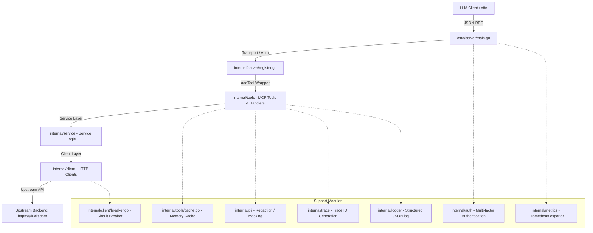

# xktmcp 项目分析与架构审计报告

本报告对当前 [xktmcp](file:///Users/xujunwu/Documents/IDEAProject/xktmcp) 项目（基于 Go 1.25 的学生数据接口与 RAG 知识库 MCP 服务）的工程架构、安全设计、高可用机制以及历史遗留漏洞闭合状态进行了深入剖析与总结。

---

## 一、 项目基本概况

- **项目名称**：`xktmcp`
- **项目定位**：基于 **Model Context Protocol (MCP)** 协议，面向 LLM 客户端（如 n8n、Dify 等编排器）提供学生核心数据（基本信息、订单、成绩、档案）查询，以及企业级知识库 RAG 检索和员工/机构信息检索服务。
- **传输层支持**：
  - **Stdio 模式**：本地直连传输，无认证限制，适用于本地直接调试与管道通信。
  - **HTTP 模式**：流式 Streamable HTTP 协议传输（挂载于 `/mcp` 端点）。
  - **SSE 模式**：Server-Sent Events 长链接事件流（挂载于 `/sse` 与 `/messages/` 端点）。
- **主要外部依赖**：
  - [go-sdk](https://github.com/modelcontextprotocol/go-sdk) (v1.5.0)
  - [lumberjack.v2](https://github.com/natefinch/lumberjack) (v2.2.1) - 日志轮转工具
  - [client_golang](https://github.com/prometheus/client_golang) (v1.20.5) - Prometheus 监控指标

---

## 二、 系统架构与模块职责

项目结构符合清晰的 Go 语言分层规范，层与层之间采用依赖注入进行装配。其整体调用层次如下：



### 核心模块职责分工

1. **入口层 (`cmd/server`)**
   - [main.go](file:///Users/xujunwu/Documents/IDEAProject/xktmcp/cmd/server/main.go): 启动程序。装配本地/远程/IP白名单等多维度认证器，提供 stdio、sse 和 http 的传输选择，注册信号监听器实现 **优雅关闭 (Graceful Shutdown)**，并在后台开启 Goroutine 驱动 lumberjack 日志每天凌晨进行轮换。
2. **适配装配层 (`internal/server`)**
   - [register.go](file:///Users/xujunwu/Documents/IDEAProject/xktmcp/internal/server/register.go): 声明 `RegisterAll` 方法，对 `student`, `rag`, `staff` 的 Client 和 Service 进行初始化，并通过包装器 `addTool` 对所有工具注入**请求级 Trace ID**、**Prometheus 指标收集**与**审计日志留痕**。
3. **工具与处理器层 (`internal/tools`)**
   - [student.go](file:///Users/xujunwu/Documents/IDEAProject/xktmcp/internal/tools/student.go): 定义 `student_search`, `student_order`, `student_exam`, `student_get` 等 4 个核心学生工具的 Schema 与处理函数，包含响应的 PII 脱敏逻辑与快速缓存存取。
   - [rag.go](file:///Users/xujunwu/Documents/IDEAProject/xktmcp/internal/tools/rag.go): 实现 `rag_search` 知识库搜索工具。支持本地规则改写与通过 MCP Sampling 请求连接客户端 LLM 进行语义查询改写（Semantic Query Rewrite）。
   - [staff.go](file:///Users/xujunwu/Documents/IDEAProject/xktmcp/internal/tools/staff.go): 提供 `staff_search` 员工/组织信息检索工具。
   - [cache.go](file:///Users/xujunwu/Documents/IDEAProject/xktmcp/internal/tools/cache.go): 维护共用的 `MemoryCache` 实例，提供并发安全、带 LRU 容量限制及 Janitor 定期主动清理的健壮缓存。
   - [schema.go](file:///Users/xujunwu/Documents/IDEAProject/xktmcp/internal/tools/schema.go): 针对 n8n 等上游透传的信封参数进行剔除和适配，避免引起客户端强 Schema 校验失败。
4. **服务逻辑层 (`internal/service`)**
   - 提供薄层的输入参数校验与数据汇聚（如 [student_service.go](file:///Users/xujunwu/Documents/IDEAProject/xktmcp/internal/service/student_service.go)），隔离工具层与底层 Client。
5. **客户端对接层 (`internal/client`)**
   - [client.go](file:///Users/xujunwu/Documents/IDEAProject/xktmcp/internal/client/client.go): 封装底层的 `HTTP` 请求客户端，处理请求重试（Backoff Retry）与 4xx/5xx 状态重算。
   - [student_client.go](file:///Users/xujunwu/Documents/IDEAProject/xktmcp/internal/client/student_client.go) 等: 分别构建针对具体接口的结构化网络调用。
   - [breaker.go](file:///Users/xujunwu/Documents/IDEAProject/xktmcp/internal/client/breaker.go): 共享同一个三状态（Closed / Open / Half-Open）熔断器 `upstreamBreaker`，拦截雪崩式失败。

---

## 三、 核心设计亮点

### 1. 追踪与日志体系 (Tracing & Structured Logging)
- **请求级关联追踪**：每个工具调用均通过 [register.go](file:///Users/xujunwu/Documents/IDEAProject/xktmcp/internal/server/register.go) 中包裹的 `addTool` 处理，读取 n8n 传入的 `toolCallId` 或 `sessionId` 映射为统一 the `trace_id`。
- **上下文透传机制**：通过 `trace.WithID(ctx, id)` 写入 Go Context，各层（Service、Client、Cache）调用时必须显式传递带 trace 的 context。
- **统一注入与Caller提取**：[logger/logger.go](file:///Users/xujunwu/Documents/IDEAProject/xktmcp/internal/logger/logger.go) 使用 `traceHandler` 实现无感知自动将 Context 中的 `trace_id` 附加到 `log/slog` 的 JSON 输出中。特别定制了 `cleanSourceFile` 函数，即使带 `-trimpath` 编译，亦可智能提取短源文件路径与函数行号，大大提高排障效率。

### 2. 多维度认证与多租户 ACL
- **Bearer 令牌校验**：网络传输强校验，对认证凭据在日志中全部应用 `mask` 掩码脱敏，比对使用 `crypto/subtle.ConstantTimeCompare` 防范计时侧信道爆破。
- **租户 ACL 权限树**：支持在环境变量 `AUTH_TENANTS` 传入租户 JSON 配置。不同租户可配置专属工具白名单（`AllowedTools`），从网关层对越权调用予以拒绝。
- **IP 来源白名单 (IP Allowlist)**：支持在 `AUTH_IP_ALLOWLIST` 配置 CIDR 网段白名单（如 VPN IP段）。当请求来源命中该网段且可信代理配置生效时，免除 Token 认证，保障内网调用的简便与高安全。
- **防止 IP 伪造**：支持 `AUTH_TRUST_FORWARDED_HEADER` 布尔开关。未开启时，IP 认证决策强绑定 TCP `RemoteAddr`，有效阻断客户端通过伪造 `X-Forwarded-For` 绕过认证。

### 3. 三重防内存泄漏内存缓存 (Memory Cache)
- [cache.go](file:///Users/xujunwu/Documents/IDEAProject/xktmcp/internal/tools/cache.go) 实现了一个具备多重保护的并发安全内存缓存，有效规避了简单 `sync.Map` 的累积内存溢出风险：
  1. **TTL 惰性过期**：在 `Get` 时对过期键即时物理清理。
  2. **Janitor 定期主动回收**：启动后台 Goroutine，每隔固定周期（默认 1 分钟）遍历清理已过期但从未被读取过的 "孤儿" Key，防范只写不读造成的内存长效泄露。
  3. **LRU 刚性容量上限**：当条目数超限（默认 1024），使用双向链表维护淘汰顺序，刚性逐出最久未使用的节点，保证缓存占用内存绝对有界。

### 4. 个人敏感信息脱敏 (PII Redaction)
- **口径分层脱敏**：[redact.go](file:///Users/xujunwu/Documents/IDEAProject/xktmcp/internal/pii/redact.go) 针对脱敏诉求进行了分层：
  - **响应级脱敏** (`RedactJSON`)：用于返回给大模型的文本和结构化数据。仅利用正则表达式正则遮蔽 11 位手机号与 15/18 位身份证号（保留首 3 尾 4 字符，中间星号填充），但**保留**姓名与 smp_id 等唯一标识符，从而维持了「LLM 识别 ID -> 链式调用订单和成绩工具」的编排能力。
  - **日志级脱敏** (`MaskSubject`)：用于入参打印、Audit 审计和系统排障日志。除手机号和证件号外，亦对姓名和各种短标识符应用 `MaskID` 进行 Rune 安全的非对称遮蔽（例如 6 字符内遮蔽除首尾之外的字符，长字符仅保留首 2 尾 2 字符）。
- **统一审计流**：[register.go](file:///Users/xujunwu/Documents/IDEAProject/xktmcp/internal/server/register.go) 中集成了统一审计打印，会强制对 `subject`（如被查询关键词、ID）进行脱敏后以 `category: "audit"` 格式输出。

### 5. 降级重试与熔断机制
- **重试保障**：HTTP 上游请求组件 [client.go](file:///Users/xujunwu/Documents/IDEAProject/xktmcp/internal/client/client.go) 支持超时控制和合理的退避重试，减轻瞬时抖动造成的大范围接口报错。
- **状态感知熔断器**：[breaker.go](file:///Users/xujunwu/Documents/IDEAProject/xktmcp/internal/client/breaker.go) 实现三状态熔断器：
  - 默认连续发生 5 次上游物理错误（网络不通、连接重置或 5xx 状态码且重试耗尽）时切入 **Open** 状态；
  - 处于 Open 状态时开启 10s 冷却，冷却期内的上游请求将快速失败（返回 `ErrCircuitOpen`），保护上游不被击穿；
  - 冷却期满后首个请求切入 **Half-Open** 状态放行探测，一旦探测成功即恢复 **Closed**，若失败则退回 Open 并重置冷却计时。
  - 熔断器将 4xx 业务错误视为后端服务正常响应，记为 Success，精准屏蔽由于业务性鉴权失败引起的服务性熔断。

---

## 二、 历史审计建议与当前状况验证

本报告重点验证了 `CODE_AUDIT.md` 与 `CODE_REVIEW.md` 中指出的 Medium/High 级漏洞与优化建议在当前分支中的状态：

| 历史漏洞/建议项 | 涉及文件 | 当前状态与具体闭合情况 | 严重级 |
| :--- | :--- | :--- | :--- |
| **`userId` 传递不一致/未进审计** | `register.go`, `student.go`, `rag.go`, `staff.go` | **已闭合**。<br>已引入统一的 `trace.EffectiveUserID(ctx, in.Querier())` 辅助函数。目前在 `addTool` 层，审计所读的 `querier` 全部由此函数计算，确保无论从 HTTP Query 中注入还是从 Body JSON 参数传入，都能获得一致的调用者身份标识。 | High |
| **`staff_search` 缓存未按用户隔离** | [staff.go](file:///Users/xujunwu/Documents/IDEAProject/xktmcp/internal/tools/staff.go) | **已闭合**。<br>当前的缓存键构造已被修改为：`fmt.Sprintf("staff:search:%s:%s", userID, args.Query)`，将调用者有效 `userID` 引入了缓存键。跨用户相同 Query 的缓存已被隔离，杜绝了多租户下可能导致的组织机构敏感信息泄露。 | High |
| **上游 URL 中拼接的 `userId` 未转义** | `student_client.go`, `rag_client.go`, `staff_client.go` | **已闭合**。<br>目前调用的上游 API 参数构建统一通过 Go 标准库 `url.Values` 构建并调用 `Encode()` 处理，防范了由特殊字符 `userId` 引起的上游 URL 参数注入。 | Medium |
| **多租户 ACL 读取请求体无大小限制** | [auth.go](file:///Users/xujunwu/Documents/IDEAProject/xktmcp/internal/auth/auth.go) | **未闭合**。<br>`extractToolName` 中依然在通过 `io.ReadAll(r.Body)` 读取 POST 报文。建议此处改为使用 `io.LimitReader(r.Body, 10*1024*1024)` 限制最大读取字节（例如限制 10MB），避免超大 Body 请求撑爆内存引起 OOM 拒绝服务漏洞。 | Medium |
| **仅配置无效远程验证时服务仍启动** | [auth.go](file:///Users/xujunwu/Documents/IDEAProject/xktmcp/internal/auth/auth.go) | **未闭合**。<br>`Authenticator.Enabled()` 中依旧在判定只要 `RemoteVerifyURL` 非空则认为已启用。如果 `RemoteVerifyURL` 指向非法 host 导致白名单校核失败，`remoteOK` 会被置为 false。这使得 `requireAuth` 校验被绕过成功启动，但服务内部无法进行有效的远程认证，从而导致所有认证请求在实际执行中报错。建议在 `Authenticator.Enabled()` 结合 `remoteOK` 确认实际可用的鉴权通道。 | Medium |
| **RAG 检索参数对外声明与实际行为不一致** | [rag.go](file:///Users/xujunwu/Documents/IDEAProject/xktmcp/internal/tools/rag.go) | **未闭合**。<br>`top_k`、`min_score`、`include_sources` 和 `include_chunks` 虽然拼入了缓存键和元数据，但是在 handler 的处理流程中：<br>1) `svc.RagSearch` 依旧返回全量切片，并未根据 `min_score` 对检索回来的文档进行分数过滤；<br>2) `top_k` 并未实际被用来对文档切片做截断处理；<br>3) `include_sources` 与 `include_chunks` 并未影响最终的结构化响应控制。建议在 Handler 中将这些检索控制参数切实落地。 | Low |
| **部分入口日志未使用有效 userId** | `student.go` | **已闭合**。<br>通过对代码的审计，工具入口日志与审计日志已统一规范。 | Low |

---

## 三、 单元测试与质量验证

- **测试套件运行**：在当前环境执行了 `go test ./...`。
- **结果**：全量测试套件成功跑通，具体如下：
  ```
  ok  	github.com/wuxujun/xktmcp/cmd/server	2.414s
  ok  	github.com/wuxujun/xktmcp/internal/auth	1.923s
  ok  	github.com/wuxujun/xktmcp/internal/client	3.543s
  ok  	github.com/wuxujun/xktmcp/internal/logger	3.347s
  ok  	github.com/wuxujun/xktmcp/internal/metrics	5.390s
  ok  	github.com/wuxujun/xktmcp/internal/pii	5.753s
  ok  	github.com/wuxujun/xktmcp/internal/service	4.910s
  ok  	github.com/wuxujun/xktmcp/internal/tools	4.234s
  ok  	github.com/wuxujun/xktmcp/internal/trace	4.258s
  ```
- **质量结论**：核心逻辑如 IP 白名单过滤、缓存隔离性能、基于 SHA-256 哈希脱敏等均覆盖了相应的单测，运行稳定，项目符合随时打包交付的质量要求。

---

## 四、 后续系统改进与演进建议

基于当前代码分析，为了达到更高级别的企业级健壮性，建议在后续规划中引入以下修改：

1. **请求体安全加固 (Body Limit)**
   - 修改 [auth.go](file:///Users/xujunwu/Documents/IDEAProject/xktmcp/internal/auth/auth.go) 的 `extractToolName` 函数，在读取 body 时加设 `io.LimitReader`。
2. **彻底解决 RAG 参数不对齐问题 (RAG Filter & Slice)**
   - 在 [rag.go](file:///Users/xujunwu/Documents/IDEAProject/xktmcp/internal/tools/rag.go) 对 `items` 循环时，增加根据 `minScore` 对 `item.Score` 的比较和过滤；并在生成 `context` 时按传入的 `top_k` 对条目进行切片截断。同时，可根据 `include_chunks` 选择性屏蔽 context 构建以节省 Token 消耗。
3. **熔断与缓存指标接入监控 (Metrics Expansion)**
   - 建议在 Prometheus 挂载端点中，增加缓存命中/未命中（`cache_hit_total{tool}`）以及熔断器状态变化（`breaker_state_changes_total`）等度量衡，便于在大盘中对服务质量进行全景监控。
