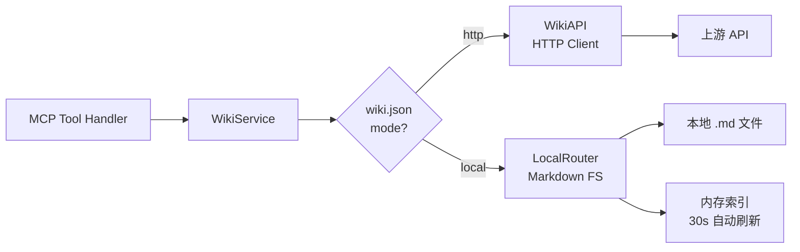

# LLM-Wiki 模块进度与优化分析报告

> 审查时间：2026-09-01 | 项目：xktmcp

---

## 一、模块总览

LLM-Wiki 模块已完成 **双后端架构**（HTTP 远程 + 本地 Markdown），实现从模型层到工具层的全链路闭环。

### 文件清单（28 个文件）

| 层级 | 文件 | 状态 |
|:---|:---|:---:|
| **配置** | [wiki.json](file:///Users/xujunwu/Documents/IDEAProject/xktmcp/config/wiki.json), [wiki.example.json](file:///Users/xujunwu/Documents/IDEAProject/xktmcp/config/wiki.example.json) | ✅ |
| **模型** | [wiki_model.go](file:///Users/xujunwu/Documents/IDEAProject/xktmcp/internal/model/wiki_model.go) | ✅ |
| **客户端** | [wiki_client.go](file:///Users/xujunwu/Documents/IDEAProject/xktmcp/internal/client/wiki_client.go) + 2 个测试文件 | ✅ |
| **熔断器** | [breaker.go](file:///Users/xujunwu/Documents/IDEAProject/xktmcp/internal/client/breaker.go) (`wikiBreaker`) | ✅ |
| **业务层** | [wiki_service.go](file:///Users/xujunwu/Documents/IDEAProject/xktmcp/internal/service/wiki_service.go) + 测试 | ✅ |
| **MCP 工具** | [wiki.go](file:///Users/xujunwu/Documents/IDEAProject/xktmcp/internal/tools/wiki.go) + 测试 | ✅ |
| **注册** | [register.go](file:///Users/xujunwu/Documents/IDEAProject/xktmcp/internal/server/register.go) | ✅ |
| **本地后端** | [internal/wiki/](file:///Users/xujunwu/Documents/IDEAProject/xktmcp/internal/wiki) — 15 个文件 | ✅ |
| **规划文档** | [backlinks-index plan](file:///Users/xujunwu/Documents/IDEAProject/xktmcp/docs/superpowers/plans/2026-09-01-wiki-backlinks-index.md) + spec | ✅ 已实施 |

---

## 二、功能完成度

### 5 个 MCP 工具 — 全部就绪 ✅

| 工具名 | 功能 | 缓存 | PII | 测试 |
|:---|:---|:---:|:---:|:---:|
| `wiki_search` | 知识库全文检索 | 2min ✅ | ✅ | ✅ |
| `wiki_get_page` | 获取词条详情 | 5min ✅ | ✅ | ✅ |
| `wiki_list_tree` | 目录树浏览 | 10min ✅ | ✅ | ✅ |
| `wiki_upsert_page` | 创建/更新词条 | 按用户写后失效 ✅ | ✅ | ✅ |
| `wiki_get_backlinks` | 反向引用查询 | 本地预计算索引 ✅ / HTTP 无工具缓存 | ✅ | ✅ |

### 双后端架构 — 全部就绪 ✅



| 本地后端子模块 | 文件 | 功能 |
|:---|:---|:---|
| 配置解析 | [config.go](file:///Users/xujunwu/Documents/IDEAProject/xktmcp/internal/wiki/config.go) | 路径安全校验、`~/` 展开、相对路径解析、多用户隔离 |
| 全文检索 | [local_search.go](file:///Users/xujunwu/Documents/IDEAProject/xktmcp/internal/wiki/local_search.go) | TF-IDF + 分词 + 内存快照索引、30s 周期刷新 |
| 页面读取 | [local_page.go](file:///Users/xujunwu/Documents/IDEAProject/xktmcp/internal/wiki/local_page.go) | 从索引快照读取 Markdown 原文 |
| 目录树 | [local_tree.go](file:///Users/xujunwu/Documents/IDEAProject/xktmcp/internal/wiki/local_tree.go) | 按目录结构生成递归 `WikiNode` 树 |
| 写入/追加 | [local_upsert.go](file:///Users/xujunwu/Documents/IDEAProject/xktmcp/internal/wiki/local_upsert.go) | create/update/append 三种模式、写后立即触发刷新 |
| 反向引用 | [local_backlinks.go](file:///Users/xujunwu/Documents/IDEAProject/xktmcp/internal/wiki/local_backlinks.go) | 刷新时预计算 `[[wiki link]]` 和 Markdown 反向链接索引，查询直接读取快照 |
| Markdown 解析 | [markdown.go](file:///Users/xujunwu/Documents/IDEAProject/xktmcp/internal/wiki/markdown.go) | frontmatter 提取、链接解析 |
| 用户路由 | [local_router.go](file:///Users/xujunwu/Documents/IDEAProject/xktmcp/internal/wiki/local_router.go) | 多用户目录隔离、默认回退 |

---

## 三、测试状态

```
$ go test ./...
ok   github.com/wuxujun/xktmcp/internal/client   (cached)
ok   github.com/wuxujun/xktmcp/internal/service   (cached)
ok   github.com/wuxujun/xktmcp/internal/tools     (cached)
ok   github.com/wuxujun/xktmcp/internal/wiki      (cached)
ok   github.com/wuxujun/xktmcp/internal/server    (cached)
     ... 全部 PASS
```

> [!TIP]
> 所有包 100% 通过，零失败、零跳过。

---

## 四、待优化功能分析

### 🔴 高优先级

#### 1. Upsert 按用户精细化缓存失效（已完成）
- **现状**：`WikiUpsertPageHandler` 成功后按有效 `userID` 清理当前用户的页面、搜索、目录树和反向链接缓存，不再影响其他用户。
- **兼容回退**：无法取得用户标识时仍清理整个 `wiki:` 命名空间，避免产生无法归属的陈旧缓存。
- **验证**：已增加多用户隔离回归测试，覆盖“用户 A 写入不清除用户 B 缓存”和空用户全局回退。

#### 2. 并发写入版本冲突控制
- **现状**：本地写入已经通过临时文件、`Sync` 和 `os.Rename` 原子替换，不会产生半文件；但多个写入者基于同一旧版本更新时仍可能后写覆盖先写。
- **影响**：单写入者场景无需处理；多进程或高并发编辑同一页面时存在丢失更新风险。
- **建议**：增加 `expected_version` 或 ETag 乐观锁，在版本不匹配时返回冲突。

#### 3. HTTP Backlinks 可选缓存
- **现状**：本地模式查询使用预计算索引；HTTP 模式仍会调用远程后端。
- **影响**：仅远程后端高频查询时可能增加网络开销。
- **建议**：有实际指标证明需要时，再增加短 TTL 缓存；不是当前正确性必需项。

### 🟡 中优先级

#### 4. 本地搜索精度可提升
- **现状**：[local_search.go](file:///Users/xujunwu/Documents/IDEAProject/xktmcp/internal/wiki/local_search.go) 使用简单的 TF-IDF + 字符级分词。
- **影响**：中文检索场景下，字符级 n-gram 分词的召回率和精确度不如基于词典的分词。
- **建议**：
  - 引入 `jieba-go` 或 `sego` 中文分词库
  - 或者添加 bigram/trigram 索引提升中文查询命中率

#### 5. 缺少 `model/wiki_model.go` 的单元测试
- **现状**：`internal/model` 包无测试文件（`[no test files]`）。
- **影响**：模型的 JSON 序列化/反序列化行为无回归保护。
- **建议**：添加 `wiki_model_test.go`，验证 JSON tag、零值处理和递归 `WikiNode` 序列化。

#### 6. Wiki 工具的 Structured Output 可增强
- **现状**：`wiki_search` 和 `wiki_get_backlinks` 的 Handler 返回 `mcp.NewTextContent(jsonStr)` + 结构化 data。
- **影响**：LLM 主要依赖文本内容，结构化数据仅用于程序化消费。当结果较多时，文本 JSON 可能过于冗长。
- **建议**：在 `wiki_search` 中添加摘要格式（如 `Found N results for "query"`），让文本更适合 LLM 阅读。

### 🟢 低优先级

#### 7. 本地写入原子化（已完成）
- **现状**：[local_upsert.go](file:///Users/xujunwu/Documents/IDEAProject/xktmcp/internal/wiki/local_upsert.go) 已使用同目录临时文件、`Sync` 和 `os.Rename` 原子替换。
- **后续**：只有需要解决并发丢失更新时，才增加版本冲突控制；无需再实现基础原子写。

#### 8. 配置热加载
- **现状**：`wiki.json` 仅在启动时加载一次。
- **影响**：修改配置需重启服务。
- **建议**：通过 `fsnotify` 或 SIGHUP 信号触发配置重载。

#### 9. HTTP 客户端超时配置（已完成）
- **现状**：Wiki HTTP Client 使用统一 `Config.Timeout`，可通过 `TIMEOUT_SECONDS` 配置，默认 10 秒。
- **后续**：仅当 Wiki 与其他上游确实需要不同超时时，再增加 Wiki 专属配置。

---

## 五、架构质量评估

| 维度 | 评分 | 说明 |
|:---|:---:|:---|
| **代码完整性** | ⭐⭐⭐⭐⭐ | 28 个文件全部实现，无桩代码 |
| **架构解耦** | ⭐⭐⭐⭐⭐ | `WikiBackend` 接口 + 双后端，LocalRouter 多用户隔离 |
| **错误处理** | ⭐⭐⭐⭐⭐ | 定义化错误、上游错误提取、熔断器集成 |
| **安全合规** | ⭐⭐⭐⭐⭐ | PII 脱敏贯穿入/出参、路径遍历防护、写入目录约束 |
| **可观测性** | ⭐⭐⭐⭐⭐ | Trace ID 贯穿、Prometheus 指标、审计日志 |
| **测试覆盖** | ⭐⭐⭐⭐ | 覆盖全面但 model 层无测试 |
| **缓存策略** | ⭐⭐⭐⭐⭐ | 差异化 TTL + 按用户写后失效；HTTP backlinks 缓存按指标选配 |
| **检索精度** | ⭐⭐⭐ | TF-IDF 足用，中文场景精度可提升 |

---

## 六、建议优先执行顺序

| 序号 | 优化项 | 预估工作量 | 优先级 |
|:---:|:---|:---:|:---:|
| 1 | 增加 `expected_version`/ETag 乐观锁 | 1-2h | 🔴（存在并发写入时） |
| 2 | 基于指标决定 HTTP Backlinks 短 TTL 缓存 | 0.5h | 🟡 |
| 3 | 使用真实查询集评估中文检索，再决定分词优化 | 2-4h | 🟡 |
| 4 | model 层 JSON 回归测试 | 0.5h | 🟢 |
