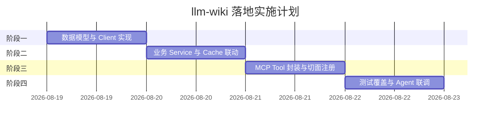

# xktmcp 接入 llm-wiki MCP 功能规划与可行性分析报告

## 一、 会话背景与项目概况

在当前会话中，针对基于 Go 1.25 / MCP Go SDK 的企业级 MCP 服务项目 [`xktmcp`](file:///Users/xujunwu/Documents/IDEAProject/xktmcp)（支持学生数据查询、RAG 知识库检索、员工组织信息检索），进行了引入 **`llm-wiki`（知识维基 / Wiki 词条与文档管理）MCP 功能** 的可行性分析与实施路径规划。

---

## 二、 现状与技术可行性分析

### 1. 项目基础与技术适配性
- **协议与框架标准**：基于官方 `github.com/modelcontextprotocol/go-sdk/mcp` (v1.5.0)，具备良好的扩展能力与标准 JSON-RPC 规范。
- **架构解耦清晰**：项目采用四层分层模型（`cmd/server` $\rightarrow$ `internal/server` $\rightarrow$ `internal/tools` $\rightarrow$ `internal/service` $\rightarrow$ `internal/client`），新增 Wiki 模块可做到**零侵入、模块化插拔**。
- **现成切面基础设施**：
  - **全链路追踪**：`addTool` 包装器自动注入 `trace_id`，贯穿上下文及结构化日志。
  - **多维度鉴权与 ACL**：天然支持多租户（Tenant）工具白名单（`AllowedTools`），便于对 Wiki 的「读/写」操作实施细粒度权限管控。
  - **三级防护缓存 (`MemoryCache`)**：支持 TTL 过期、后台 Janitor 定期主动清理和 LRU 刚性容量控制，极为契合 Wiki 静态/准静态内容的性能加速。
  - **熔断与容灾**：`CircuitBreaker`（Closed/Open/Half-Open）可独立为 Wiki 客户端配置专用熔断器 `wikiBreaker`。
  - **数据合规与脱敏**：`pii.RedactJSON` 与 `pii.MaskSubject` 支持对 Wiki 敏感字段与审计主体进行实时脱敏。

### 2. 现有 RAG 模块与 llm-wiki 的差异与互补
- **现有 `rag_search`**：侧重于非结构化文本的切片向量召回与片段检索（只读，支持 LLM Sampling 语义改写）。
- **`llm-wiki`**：侧重于结构化 Wiki 页面（树状目录、分类、Markdown 全文、双向引用链接）的**全生命周期管理（查阅、编辑、增量沉淀、关联图谱）**。两者结合可形成「Wiki 知识沉淀 $\rightarrow$ RAG 向量切片检索」的闭环。

---

## 三、 llm-wiki MCP 工具集设计 (Tool Definitions)

规划设计 5 个核心 MCP Tools，满足 Agent/LLM 对 Wiki 的完整交互需求：

| 工具名称 | 功能描述 | 核心入参 | 核心出参 |
| :--- | :--- | :--- | :--- |
| **`wiki_search`** | 词条/页面模糊与语义搜索 | `query` (必填), `category` (分类), `top_k` (默认 5) | 词条摘要列表（ID、标题、摘要、分类、相似度） |
| **`wiki_get_page`** | 获取指定 Wiki 页面完整 Markdown 正文 | `page_id` 或 `title` | 页面元信息、Markdown 正文、目录大纲、更新时间 |
| **`wiki_list_tree`** | 获取知识库层级目录树/分类结构 | `parent_id` (可选), `depth` (遍历深度) | 树形结构节点列表（ID、标题、子节点数组） |
| **`wiki_upsert_page`** | 新建、更新或追加词条内容 *(写权限控制)* | `title`, `content`, `category`, `summary`, `mode` (`create`/`update`/`append`) | `page_id`, `version`, `status` |
| **`wiki_get_backlinks`** | 获取词条间的反向链接与引用关系 | `page_id` | 引用该词条的页面列表及上下文片段 |

---

## 四、 落地实施阶段规划

### 1. 阶段一：数据模型与底层 Client 实现
- 在 [`internal/model/wiki.go`](file:///Users/xujunwu/Documents/IDEAProject/xktmcp/internal/model) 中定义 `WikiPage`、`WikiSearchResult`、`WikiNode` 等 DTO 结构。
- 在 [`internal/client/wiki_client.go`](file:///Users/xujunwu/Documents/IDEAProject/xktmcp/internal/client) 中封装针对上游 Wiki 接口的 HTTP 调用，配置独立的 `wikiBreaker` 熔断策略与重试机制。

### 2. 阶段二：业务层 Service 与缓存策略
- 在 [`internal/service/wiki_service.go`](file:///Users/xujunwu/Documents/IDEAProject/xktmcp/internal/service) 编写入参严格校验、业务包装与数据聚合。
- 读操作（`wiki_get_page`, `wiki_list_tree`）对接 `MemoryCache`；写操作（`wiki_upsert_page`）执行成功后触发对应 Key 的主动失效。

### 3. 阶段三：MCP 工具包装与切面注册
- 在 [`internal/tools/wiki.go`](file:///Users/xujunwu/Documents/IDEAProject/xktmcp/internal/tools) 中使用 `publicSchema` 规范入参定义，实现 `AuditSubject()` 接口。
- 在 [`internal/server/register.go`](file:///Users/xujunwu/Documents/IDEAProject/xktmcp/internal/server/register.go) 通过 `addTool` 将工具统一注册至 MCP Server，自动继承审计留痕、Prometheus 指标和 Trace ID 追踪。
- 在租户配置 `AUTH_TENANTS` 中扩展 Wiki 相关权限项。

### 4. 阶段四：单元测试与智能体（n8n/Dify）联调
- 编写 Client/Service/Tool 单元测试（`*_test.go`），验证边界值、容错及脱敏逻辑。
- 启动 stdio / http 模式，通过 n8n 或 Dify 工作流实测端到端 Wiki 查阅与内容沉淀。

---

## 五、 后续演进建议

1. **多数据源适配**：底层 Client 可设计为 Interface，既支持对接企业已有 Wiki 系统（如 Confluence、语雀、自研 Wiki），也可支持基于 SQLite/Markdown 文件的轻量存储。
2. **Wiki 与 RAG 联动**：在 Wiki 页面发生变更（`upsert`）时，通过异步消息/Hook 触发 RAG 向量重切片与索引更新，保持知识库实时性。
