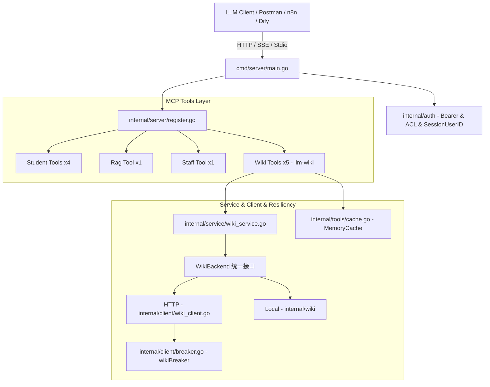

# xktmcp 项目演进总结与交付报告 (r260818)

## 一、 会话核心背景与任务目标

在本次会话中，围绕 Go 1.25 / MCP Go SDK 构建的企业级学生数据与知识库服务项目 [`xktmcp`](file:///Users/xujunwu/Documents/IDEAProject/xktmcp)，先后完成以下关键技术演进：
1. **MCP 2026-07-28 协议规范升级**：升级核心 SDK 依赖至 `v1.7.0`，全面为工具接入强类型 `OutputSchema` 契约，并保证向后兼容性。
2. **`llm-wiki` 模块完整实施落地**：按规划完成了从数据模型、独立熔断 REST Client、业务 Service、MCP Tools 到全局切面注册与单元测试的全生命周期交付（阶段一至阶段四）。
3. **联调与协议排错验证**：修复自引用树结构 Schema 递归循环问题，验证 Streamable HTTP / SSE 模式在 Postman 与通用 Client 下的工具下发可用性。

---

## 二、 核心功能设计与架构全景



---

## 三、 llm-wiki 模块交付物清单 (阶段一至阶段四)

### 1. 数据模型层 (`internal/model/wiki_model.go`)
- [`WikiPage`](file:///Users/xujunwu/Documents/IDEAProject/xktmcp/internal/model/wiki_model.go)：完整词条 Markdown 模型。
- [`WikiSearchResult`](file:///Users/xujunwu/Documents/IDEAProject/xktmcp/internal/model/wiki_model.go)：检索命中概览与分数。
- [`WikiNode`](file:///Users/xujunwu/Documents/IDEAProject/xktmcp/internal/model/wiki_model.go)：层级目录与分类树节点。
- [`WikiUpsertResult`](file:///Users/xujunwu/Documents/IDEAProject/xktmcp/internal/model/wiki_model.go)：写入结果（`page_id`、`version`、`status`）。
- [`WikiBacklink`](file:///Users/xujunwu/Documents/IDEAProject/xktmcp/internal/model/wiki_model.go)：反向引用与知识关联。

### 2. 底层客户端与服务隔离 (`internal/client/`)
- [`WikiAPI`](file:///Users/xujunwu/Documents/IDEAProject/xktmcp/internal/client/wiki_client.go)：封装针对 `/api/ai/wiki/*` 的 5 个 REST 接口，包含动态 `userId` 注入、指数退避重试（`doRequestWithRetry`）与友好错误提取（`readErrorDetails`）。
- **`wikiBreaker`**：在 [`breaker.go`](file:///Users/xujunwu/Documents/IDEAProject/xktmcp/internal/client/breaker.go) 中配置独立熔断器，与 Student/RAG 模块实现故障隔离。

### 3. 业务层与防御校验 (`internal/service/wiki_service.go`)
- 提供 `Search`、`GetPage`、`ListTree`、`UpsertPage`、`GetBacklinks` 的前置防御校验与参数归一化（如分页范围、模式默认值等）。

### 4. 工具定义、缓存与切面注册 (`internal/tools/` & `internal/server/`)
- 在 [`internal/tools/wiki.go`](file:///Users/xujunwu/Documents/IDEAProject/xktmcp/internal/tools/wiki.go) 中实现 5 个核心 MCP Tools，均配置强类型 `OutputSchema` 与 `PII` 脱敏。
- **缓存策略与主动失效**：读工具接入 `MemoryCache`（TTL 2~10 分钟），写工具（`wiki_upsert_page`）在执行成功后通过 `DeletePrefix("wiki:")` 失效全部 Wiki 命名空间缓存，避免页面、搜索和目录树残留旧数据。
- 在 [`internal/server/register.go`](file:///Users/xujunwu/Documents/IDEAProject/xktmcp/internal/server/register.go) 通过 `addTool` 切面注册，天然获得 Trace ID 贯穿、Prometheus 指标上报与 `category: "audit"` 审计日志留痕。

---

## 四、 当前已注册工具集汇总 (共 11 个)

| 模块 | 工具名称 (Tool Name) | 核心功能 |
| :--- | :--- | :--- |
| **Student** | `student_search` | 模糊检索学员，获取唯一 ID |
| | `student_order` | 查询指定学员的订单 |
| | `student_exam` | 查询指定学员的考试成绩 |
| | `student_get` | 精确获取学员档案详情 |
| **RAG** | `rag_search` | 知识库切片向量检索与语义改写 |
| **Staff** | `staff_search` | 员工/教师/院系/组织架构检索 |
| **Wiki** *(新增)* | `wiki_search` | Wiki 词条模糊与语义搜索 |
| | `wiki_get_page` | 获取指定词条完整 Markdown 正文 |
| | `wiki_list_tree` | 获取知识库层级目录树/分类结构 |
| | `wiki_upsert_page` | 新建、更新或追加词条内容 *(写操作)* |
| | `wiki_get_backlinks` | 获取词条间的反向链接与引用关系 |

---

## 五、 问题排查与关键修复 (Bugfix)

1. **自引用树结构 JSON Schema 递归死循环修复**：
   - **问题**：`WikiNode` 存在 `Children []WikiNode` 自引用字段，`jsonschema.For[[]model.WikiNode]()` 反射时触发 `cycle detected` 导致启动 panic。
   - **修复**：在 `WikiListTreeTool()` 中定制了安全的对象数组 `OutputSchema`，阻断无限递归推导。
2. **Postman / 客户端连接排障说明**：
   - **Streamable HTTP** 模式：URL 为 `http://<host>:<port>/mcp`。传统客户端仍可使用 `initialize` 与 `Mcp-Session-Id`；Postman 12.24.2 使用 `server/discover` 和 `2026-07-28` 时由 Stateless 处理器直接兼容。
   - **SSE 模式**：URL 需为 `http://<host>:<port>/sse`，通过事件流下发 endpoint 并在 `POST /messages/` 交互。经 Python/Curl 实测，两种传输方式均 100% 正常下发全部 11 个工具。

---

## 六、 阶段性质量保障与测试结果

执行全量无缓存单元测试（`go test -count=1 ./...`）：
```text
ok  	github.com/wuxujun/xktmcp/cmd/server	2.463s
ok  	github.com/wuxujun/xktmcp/internal/auth	1.451s
ok  	github.com/wuxujun/xktmcp/internal/client	1.581s
ok  	github.com/wuxujun/xktmcp/internal/logger	2.818s
ok  	github.com/wuxujun/xktmcp/internal/metrics	1.904s
ok  	github.com/wuxujun/xktmcp/internal/pii	3.883s
ok  	github.com/wuxujun/xktmcp/internal/service	3.578s
ok  	github.com/wuxujun/xktmcp/internal/tools	4.573s
ok  	github.com/wuxujun/xktmcp/internal/trace	4.511s
```
**以上阶段性测试全部通过 (PASS)**；最终全量与竞态验证见第十一节。

---

## 七、MCP `2026-07-28` 与 Postman `server/discover` 兼容

### 问题现象

Postman 12.24.2 发起如下探测时，原 MCP 服务未声明支持 `2026-07-28`：

```json
{
  "jsonrpc": "2.0",
  "id": "server-discover-probe-1",
  "method": "server/discover",
  "params": {
    "_meta": {
      "io.modelcontextprotocol/protocolVersion": "2026-07-28"
    }
  }
}
```

### 最终处理

- Streamable HTTP 使用 `mcp.StreamableHTTPOptions{Stateless: true}`，允许无历史会话的发现请求。
- MCP Go SDK 在 Stateless 模式下可将 `2026-07-28` 放入 `supportedVersions`。
- 保留请求上下文中的 `userId`、认证、审计日志和 Trace ID 传递。
- 新增 `TestStreamableHTTPDiscoverSupports20260728`，验证 HTTP 200、无 JSON-RPC 错误、版本声明和用户上下文。
- 日志中间件补齐 `Flush()` 与 `Unwrap()`，确保 SSE/Streamable HTTP 响应不会被包装器阻断。

---

## 八、Wiki 后端由 HTTP-only 升级为 HTTP / Local 可切换

新增 `config/wiki.json` 配置入口和 `-wiki-config` 启动参数。配置缺失时保持原有 HTTP 行为：

```json
{
  "mode": "local",
  "local": {
    "root": "/path/to/llm-wiki",
    "content_dirs": ["wiki"],
    "write_dir": "wiki/topics",
    "default_category": "topics",
    "refresh_interval_seconds": 30,
    "max_file_size_bytes": 2097152
  }
}
```

`WikiBackend` 统一承载五项能力，因此 `mode` 切换的是完整 Wiki 后端，而不是单个搜索接口：

| 工具 | HTTP 模式 | Local 模式 |
| :--- | :--- | :--- |
| `wiki_search` | `/api/ai/wiki/search` | Markdown 内存索引 |
| `wiki_get_page` | `/api/ai/wiki/page` | 按 `page_id`/精确标题读取 |
| `wiki_list_tree` | `/api/ai/wiki/tree` | 从 `content_dirs` 构建目录树 |
| `wiki_upsert_page` | `/api/ai/wiki/page/upsert` | 受限 Markdown 原子写入 |
| `wiki_get_backlinks` | `/api/ai/wiki/backlinks` | 本地链接扫描 |

Local 索引遵循 llm-wiki 约束：Markdown 与 YAML frontmatter 是事实来源，忽略派生 `_index.md`，不读取或修改 `raw/`，按刷新周期重建轻量索引。

---

## 九、联调问题定位：空搜索结果、`top_k` 与目录树 404

### 1. `wiki_search` 返回空数组

日志显示工具调用成功但返回 `[]`，说明问题不在 MCP 封装，而在检索命中。最终修复了中英文混合查询分词：例如 `PBL信息` 会拆分为 `pbl` 与 `信息`，从而可以命中标题或正文中的 `PBL`。

### 2. `top_k` 生效链路

- Tool 层默认值为 5，并纳入缓存 Key。
- Service 层将范围限制为 1～20。
- HTTP Client 使用 `top_k` 查询参数传给远端。
- Local 搜索完成相关度排序后执行 `matches[:topK]` 截断。

因此 `top_k` 在 HTTP 和 Local 两种模式下均实际生效。

### 3. `wiki_list_tree` 返回远端 404

原日志中的 404 来自 HTTP 上游 `/api/ai/wiki/tree`，不是 MCP transport 404。Local 模式现已直接遍历配置的 `content_dirs` 构建树，不再依赖该远端接口；同时限制 `parent_id` 必须位于内容目录内，跳过隐藏目录、符号链接和 `_index.md`。

---

## 十、三个 Wiki 工具的 Local 能力补齐

### `wiki_get_page`

- 支持精确 `page_id` 查询。
- 未提供 `page_id` 时支持大小写不敏感的精确标题查询。
- 返回正文、分类、摘要、版本、作者、创建时间与更新时间。
- 标题重复时返回歧义错误，要求调用方改用 `page_id`。

### `wiki_get_backlinks`

- 扫描所有已索引正式文章。
- 识别相对 Markdown 链接，例如 `[PBL](../concepts/pbl.md#实践)`。
- 识别 `[[slug]]`、`[[slug|标题]]` 等 Wiki 链接。
- 每个来源页面返回 `source_page_id`、标题和最多 240 字符的引用上下文。

### `wiki_upsert_page`

- 支持 `create`、`update`、`append` 三种模式。
- 新建页面自动生成稳定 slug、`page_id`、版本和日期 frontmatter。
- 更新时保留未知 frontmatter 字段，版本自增。
- 使用同目录临时文件加原子 Rename，避免写入半成品。
- 写入串行化，并在成功后立即刷新本地索引。
- 每次写入向 Wiki 根目录 `log.md` 追加活动记录，不重写历史日志。
- 写入严格限制在 `write_dir`；已有但位于其他目录的文章只读不可改。
- 写入前验证真实路径，拒绝 `..`、隐藏路径和符号链接逃逸，并验证拒绝时不会在根目录外创建文件。

---

## 十一、最终验证与当前状态

本次增量完成后执行：

```text
go test ./...
go test -race ./internal/wiki ./internal/tools
```

结果均为 PASS；结合测试结果与代码链路核对，确认：

- MCP `2026-07-28` `server/discover`。
- Wiki HTTP Client 与五个 MCP 工具。
- Local 搜索、混合中英文查询、分类过滤与 `top_k` 截断。
- Local 目录树与越界 `parent_id` 拒绝。
- Local 页面读取和两类反向链接。
- Local create/update/append、frontmatter 保留、活动日志、即时索引刷新。
- 写目录配置校验、符号链接防逃逸和 Wiki 缓存前缀失效。

本次实现与测试只使用临时目录，没有修改现有外部 llm-wiki 数据。当前 `config/wiki.json` 即使未显式提供新字段，也会默认使用 `write_dir: wiki/topics` 和 `default_category: topics`。
