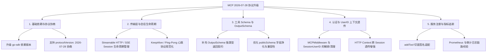

# xktmcp 升级支持 MCP 2026-07-28 规范分析与改动清单

## 一、 概述

本文档针对 [`xktmcp`](file:///Users/xujunwu/Documents/IDEAProject/xktmcp) 项目（基于 Go 1.25 / MCP Go SDK 的学生数据与知识库服务）升级至 **MCP 2026-07-28 规范版本** 进行系统级影响分析，并明确具体的改动范围与改造清单。

---

## 二、 核心改动全景图

---

## 三、 详细改动清单与受影响模块

### 1. 基础依赖与协议协商层 (`go.mod` & `cmd/server/main.go`)

- **依赖升级**：
  - 更新 [`go.mod`](file:///Users/xujunwu/Documents/IDEAProject/xktmcp/go.mod) 中 `github.com/modelcontextprotocol/go-sdk` 至支持 2026-07-28 规范的版本（如 `v1.6.0+` 或更新版本）。
  - 执行 `go mod tidy` 并确认 `github.com/google/jsonschema-go` 等间接依赖的兼容性。
- **协议版本与 Server 初始化**：
  - 在 [`cmd/server/main.go`](file:///Users/xujunwu/Documents/IDEAProject/xktmcp/cmd/server/main.go) 中初始化 `mcp.NewServer` 时，确保 `Implementation` 支持向客户端回传 2026-07-28 的 `protocolVersion`。
  - 检查并兼容客户端发起 `initialize` 请求时所携带的 `protocolVersion: "2026-07-28"` 握手降级与多版本兼容逻辑。

---

### 2. 传输层与会话 (Session) 生命周期管控 (`cmd/server/main.go` & `internal/auth/`)

- **Session 生命周期与回收机制**：
  - 2026-07-28 强化了长连接（Streamable HTTP / SSE）的 Session 状态管理。
  - 在 [`internal/auth/auth.go`](file:///Users/xujunwu/Documents/IDEAProject/xktmcp/internal/auth/auth.go) 的 `sessionUserID sync.Map` 中，需增加 **Session 关闭/断开事件监听**（通过 `s.OnSessionClosed` 钩子或带 TTL 的清理机制），防止长周期运行下的无界内存占用。
- **KeepAlive 与 Ping 协议**：
  - 校验 `KeepAlive: 30 * time.Second` 在 2026-07-28 下的 Ping/Pong 双向通信行为，避免反向代理或网关（如 Nginx、Traefik）误判超时断连。

---

### 3. 工具模式与 Schema 体系优化 (`internal/tools/`)

- **输出强契约支持 (`OutputSchema`)**：
  - 新规范鼓励或要求 MCP Tool 提供显式的 `OutputSchema`。
  - 需针对 [`rag.go`](file:///Users/xujunwu/Documents/IDEAProject/xktmcp/internal/tools/rag.go)（`RagSearchResponse`）、[`student.go`](file:///Users/xujunwu/Documents/IDEAProject/xktmcp/internal/tools/student.go)（`StudentSearchResponse` 等）、[`staff.go`](file:///Users/xujunwu/Documents/IDEAProject/xktmcp/internal/tools/staff.go) 通过 `jsonschema.For[T]()` 自动生成输出 Schema，方便大模型编排层（如 n8n / Dify）更精确地进行结构化输出解析。
- **信封字段净化机制校验 (`schema.go`)**：
  - 检查 [`internal/tools/schema.go`](file:///Users/xujunwu/Documents/IDEAProject/xktmcp/internal/tools/schema.go) 中的 `publicSchema` 函数，确保去除 `envelopeFields`（如 `sessionId`, `toolCallId` 等）后，在 2026-07-28 规范的 JSON Schema 验证器下依然放行透传字段（`AdditionalProperties = nil`）。

---

### 4. 认证、中间件与上下文透传 (`internal/auth/` & `internal/trace/`)

- **MCP 消息中间件适配**：
  - [`internal/auth/auth.go`](file:///Users/xujunwu/Documents/IDEAProject/xktmcp/internal/auth/auth.go) 中使用的 `s.AddReceivingMiddleware(authenticator.MCPMiddleware())`：
    - 需核对新 SDK 中 `ReceivingMiddleware` 接口签名的变更（例如入参是否扩展了 `SessionContext`、`RequestMeta`）。
    - 确保 `trace.EffectiveUserID(ctx, args.UserID)` 能无缝从新版 Session 包装层提取 `userID`。
- **多租户 ACL 白名单过滤**：
  - 租户配置（`AUTH_TENANTS`）与工具权限树过滤逻辑需兼容 2026-07-28 协议新增的动态工具列表下发（`tools/list_changed` 通知机制）。

---

### 5. 服务注册与指标追踪 (`internal/server/register.go`)

- **`addTool` 包装函数适配**：
  - 检查 `mcp.AddTool` / `server.RegisterTool` 签名是否有变动（如 context 传递方式、采样 Sampling 接口签名调整）。
  - Prometheus 指标（`metrics.ToolCallDuration` 等）与审计日志（`logger.Audit`）需校验是否完整捕获新版客户端透传的 Header/Meta 信息。

---

## 四、 改造步骤与实施计划

| 步骤 | 改造模块 | 关键动作 | 风险等级 |
| :---: | :--- | :--- | :---: |
| **Step 1** | `go.mod` | 升级 `modelcontextprotocol/go-sdk` 至 2026-07-28 兼容版本 | 🟡 中 |
| **Step 2** | `internal/auth` | 适配新版中间件签名，优化 Session Map 的清理与内存防护 | 🟢 低 |
| **Step 3** | `internal/tools` | 为全部工具补齐/适配 InputSchema 和 OutputSchema | 🟢 低 |
| **Step 4** | `cmd/server/main.go` | 验证 `stdio` / `sse` / `http` 三种传输方式的握手与心跳 | 🟡 中 |
| **Step 5** | `*_test.go` | 全量运行 `go test ./...`，补充协议协商与 Session 隔离单测 | 🟢 低 |

---

## 五、 测试基线状态

- **当前测试套件状态**：全量单元测试通过（`ok`，包含 auth, client, logger, metrics, pii, service, tools, trace 各模块）。
- **回归验证要求**：在升级 SDK 及完成上述改动后，需再次运行 `go test -count=1 ./...` 确保全部单测通过，并通过 stdio 与 http 模式发起实测握手。
